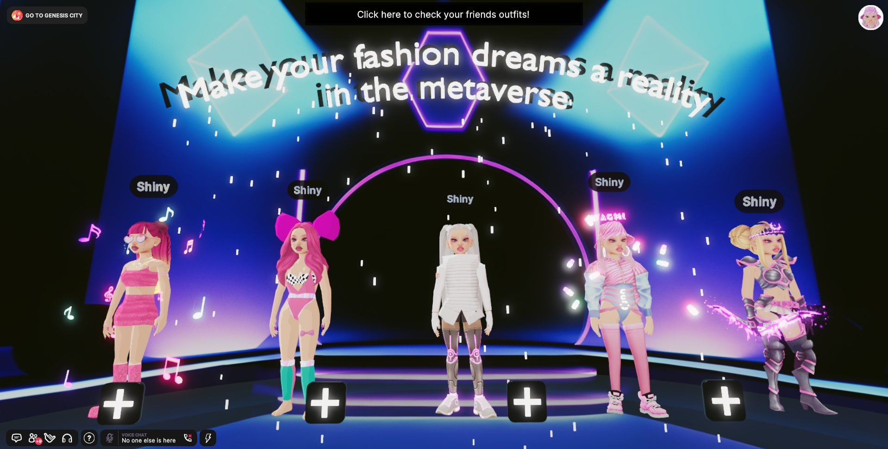
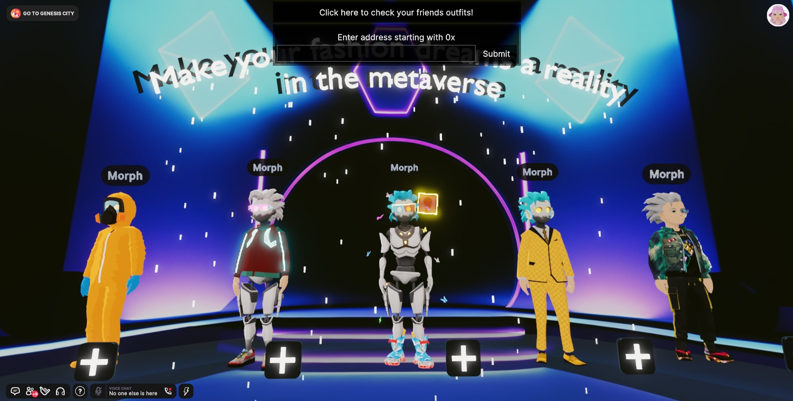
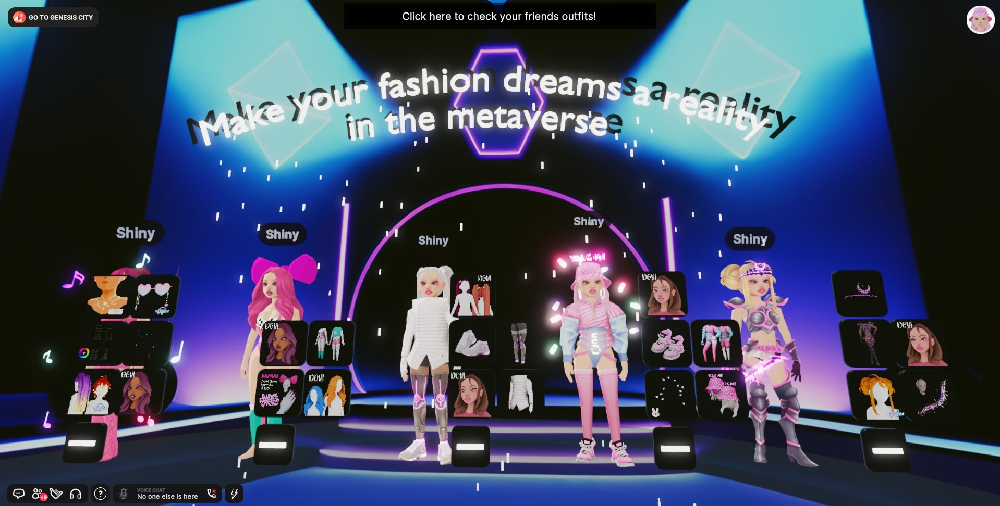
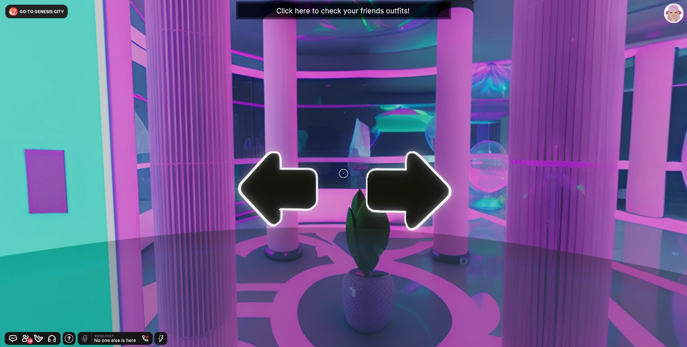

# Project description

This project contains interactive scene created for Decentraland Game Jam 2023 based on the theme 'Lucid Dreams'. It is written using Decentraland SDK version 7. All of the code and models have been created during the contest period. Scene uses Decentraland API:

- https://peer.decentraland.org/ - for getting user profile and outfits
- https://nft-api.decentraland.org/v1 - for getting wearable details by contract address and token ID

Currently deployed under Decentraland name `Outfits`. Follow [this link](https://play.decentraland.org/?realm=Outfits.dcl.eth) or type in the Decentraland chatbox `/changerealm Outfits.dcl.eth` to visit the scene.

Experience is created for the recently introduced feature - outfits. It is suggested that before entering the scene you have some outfits created, but if you don't have any you can visit the scene anyways and checkout your friends outfits.

Features:

- See your outfits - if you have any created then they will appear when entering the scene
  
- Checkout you friends outfits - use the button at the top of the 2D UI and enter your friends ETH address starting with 0x
  
- See outfit details by clicking on '+' button next to outfit. You will be able to see only Polygon wearables, clicking on some tile will open Marketplace.
  
- Change the scene look by changing skyboxes. Use arrow buttons to switch to next or previous skybox.
  

## Use of AI

#### Blockade Labs Skybox AI Tool

Skyboxes generated using Blockade Labs [Skybox AI tool](https://skybox.blockadelabs.com/) licensed under the [CC BY 4.0 license](https://creativecommons.org/licenses/by/4.0/)

## Try it out

1. Download this repository.

2. Install the [Decentraland Editor](https://docs.decentraland.org/creator/development-guide/sdk7/editor/)

3. Open a Visual Studio Code window on this scene's root folder. Not on the root folder of the whole repo, but instead on this sub-folder that belongs to the scene.

4. Open the Decentraland Editor tab, and press **Run Scene**

Alternatively, you can use the command line. Inside this scene root directory run:

```
npm i
npm run start
```

## Copyright info

This scene is protected with a standard Apache 2 licence. See the terms and conditions in the [LICENSE](/LICENSE) file.
